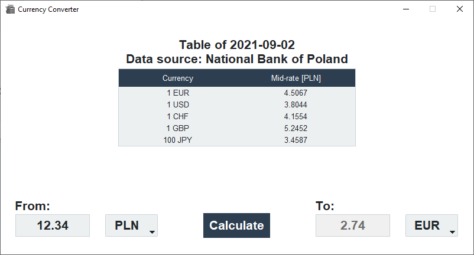

# Currency converter
## Introduction
Currency converter application built using Python (Beautiful Soup, Requests, Tkinter and ttkbootstrap).

## Setup
First install the dependencies (required packages) using the following command:
```shell
pip3 install -r requirements.txt
```
Then run main .py script using the command:
```shell
python currency_converter.py
```
This will launch the graphical user interface (GUI) of the application.

## Preview
<p align="center">
  
</p>

## References
| No. | Reference | Source |
|:---:|:---:|:---:|
| 1. |  The exchange rates are retrieved by web scraping from the National Bank of Poland main website. | [URL](https://www.nbp.pl/) |